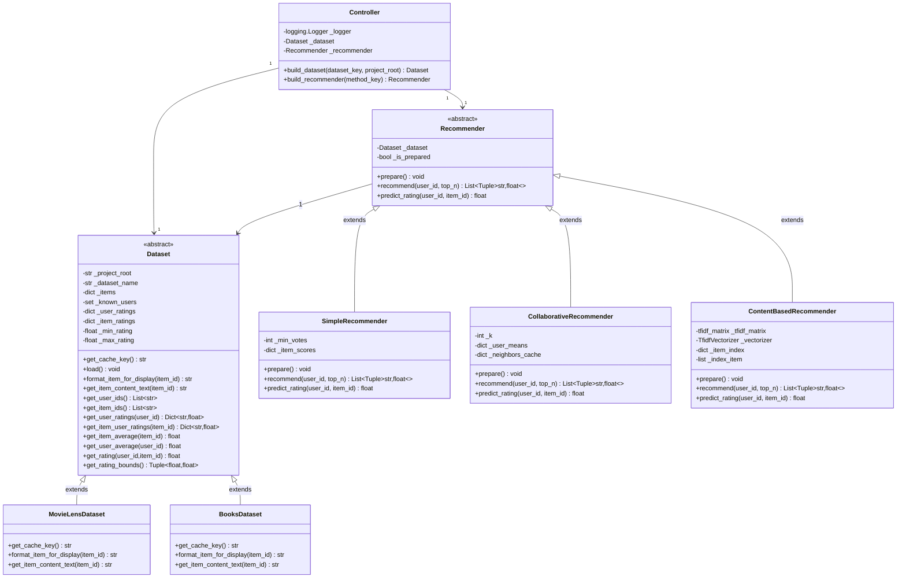
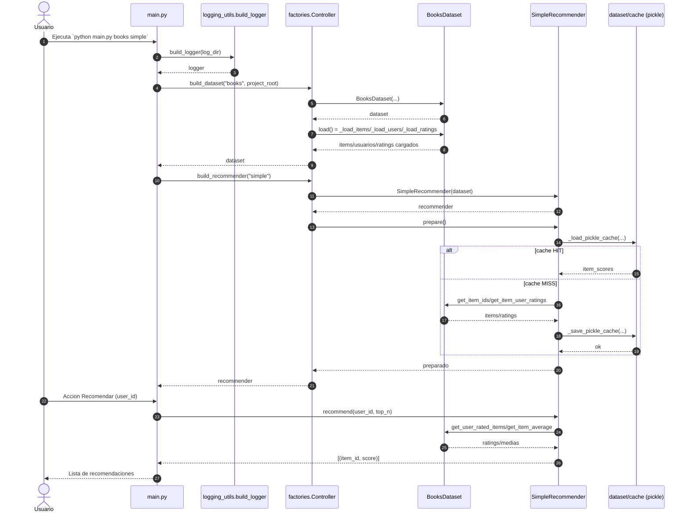
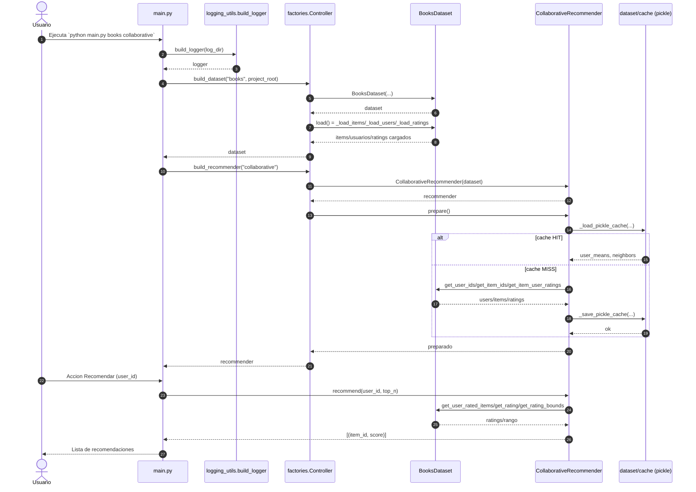
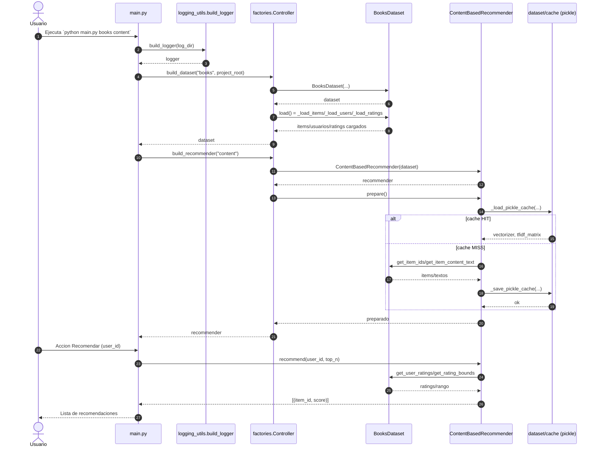
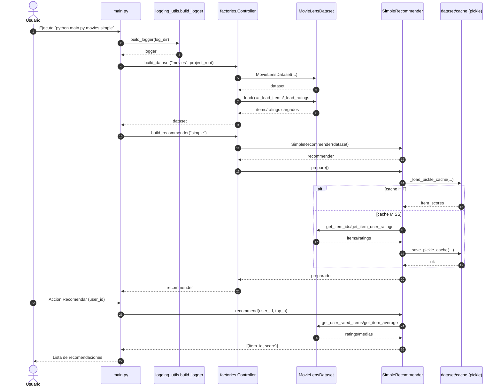
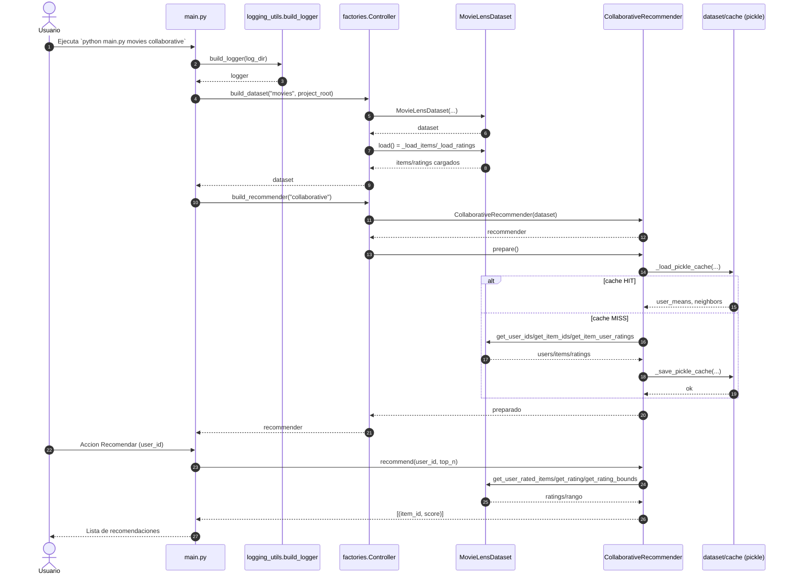
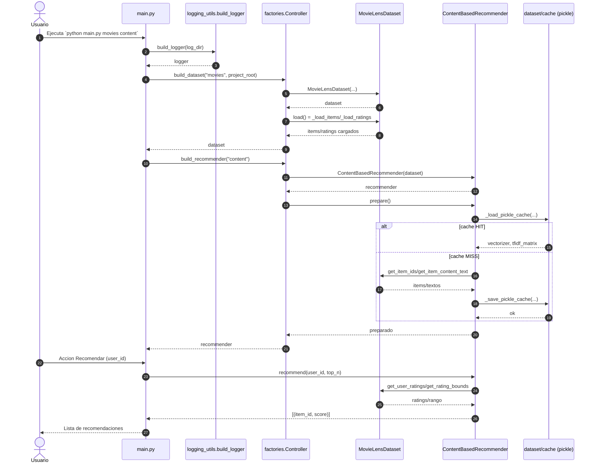

# Sistema de recomendacion (Proyecto PA)

## Descripcion general
Proyecto de recomendacion con tres enfoques (simple, colaborativo y basado en contenido) y soporte para dos datasets (MovieLens100k y Book-Crossing). Incluye carga de datos desde CSV, generacion de recomendaciones, evaluacion con MAE/RMSE y comparacion grafica entre metodos.

## Estructura del proyecto
```
projectePA/
  datasets.py
  evaluation.py
  factories.py
  fase.py
  logging_utils.py
  main.py
  recommenders.py
  dataset/
    Books/
      Books.csv
      Ratings.csv
      Users.csv
    MovieLens100k/
      links.csv
      movies.csv
      ratings.csv
      tags.csv
    cache/
      (caches .pkl generados automaticamente)
  logs/
    log_YYYYMMDD-HHMMSS.txt
```

## Archivos y contenido

### datasets.py
- `Dataset` (abstracta): capa base de datos. Gestiona items, usuarios, ratings, rangos de rating y utilidades de consulta.
- `MovieLensDataset`: carga items y ratings desde `dataset/MovieLens100k`.
- `BooksDataset`: carga items, usuarios y ratings desde `dataset/Books`, con limite de libros configurable.

### recommenders.py
- `Recommender` (abstracta): interfaz comun para preparar, recomendar y predecir ratings. Gestiona rutas de cache.
- `SimpleRecommender`: popularidad con promedio bayesiano (usa `min_votes`).
- `CollaborativeRecommender`: filtrado colaborativo usuario-usuario con similitud coseno (media centrada).
- `ContentBasedRecommender`: TF-IDF sobre contenido de items (generos o autor) y perfil de usuario ponderado por rating.
- Utilidades internas: `_load_pickle_cache`, `_save_pickle_cache` para caches atomicos.

### evaluation.py
- `mae`, `rmse`: metricas de error.
- `evaluate_user`: evalua un usuario con MAE/RMSE usando `predict_rating`.
- `plot_evaluation`: grafico comparativo con matplotlib.

### factories.py
- `Controller`: clase con metodos `build_dataset` y `build_recommender`.

### logging_utils.py
- `build_logger`: logger con salida a consola y fichero en `logs/`.

### main.py
- CLI principal. Valida argumentos, carga dataset/recommender, y ejecuta un bucle interactivo con acciones: recomendar, evaluar, comparar.

### fase.py
- Punto de entrada alternativo que ejecuta `main()`.

### dataset/
- Datos CSV de MovieLens100k y Book-Crossing.
- `cache/`: se generan caches `.pkl` para acelerar el preprocesado de los recomendadores.

### logs/
- Logs con timestamp generados en cada ejecucion.

## Diagrama de clases (completo)



## Diagramas de secuencia (6 casos)

### Books + Simple (primero)



### Books + Collaborative



### Books + Content



### Movies + Simple



### Movies + Collaborative



### Movies + Content



## Requisitos
- Python 3
- Dependencias principales: `numpy`, `scikit-learn`, `matplotlib`

Ejemplo de instalacion:
```
pip install numpy scikit-learn matplotlib
```

## Uso

### Ejecutar el programa
```
python main.py <dataset> <metodo>
```

- `<dataset>`: `movies` | `books`
- `<metodo>`: `simple` | `collaborative` | `content`

Ejemplo:
```
python main.py movies collaborative
```

### Flujo interactivo
1. Introducir un `user_id` valido.
2. Elegir accion:
   - Recomendar: muestra top-N recomendaciones.
   - Evaluar: muestra MAE/RMSE para ese usuario.
   - Comparar: evalua los tres metodos y genera grafico.

## Notas
- Los caches se guardan en `dataset/cache` y aceleran ejecuciones posteriores.
- Los logs se escriben en `logs/` con nombre `log_YYYYMMDD-HHMMSS.txt`.
