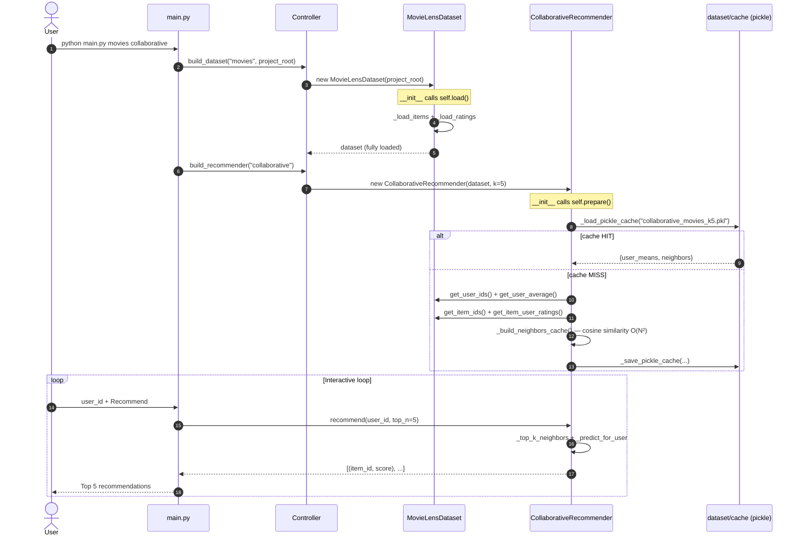

# Modular Recommendation System

A command-line recommendation system built in Python that implements three independent algorithms — **Simple (Bayesian Average)**, **Collaborative Filtering**, and **Content-Based (TF-IDF)** — on two datasets: **MovieLens 100k** and **Book-Crossing**. Designed as an academic exercise applying OOP principles (SRP, LSP, DRY, Information Hiding, Favor Composition, Law of Demeter) and all GRASP patterns (Information Expert, Creator, Controller, Low Coupling, High Cohesion, Polymorphism, Pure Fabrication).

---

## Features

- **3 recommendation algorithms**: popularity-based (Bayesian Average), user-based collaborative filtering (cosine similarity), and content-based (TF-IDF user profile).
- **2 datasets**: MovieLens 100k (movies + genres) and Book-Crossing (books + authors).
- **Evaluation metrics**: MAE and RMSE per user, with side-by-side comparison of all three methods.
- **Pickle cache**: model state is serialized after the first run; subsequent launches load from cache for fast startup.
- **Structured logging**: `DEBUG` to file, `INFO` to console, with timestamped log files under `logs/`.

---

## Project Structure

```
projectePA/
├── main.py              — CLI entry point and interactive loop
├── controller.py        — factory + controller (GRASP Controller/Creator)
├── datasets.py          — domain data classes (Dataset hierarchy)
├── recommenders.py      — recommendation engines (3 algorithms)
├── evaluation.py        — MAE/RMSE metrics and comparison table
├── logging_utils.py     — logging configuration (Pure Fabrication)
├── dataset/
│   ├── Books/
│   │   ├── Books.csv    — book metadata (ISBN, title, author)
│   │   ├── Ratings.csv  — user ratings (User-ID, ISBN, Book-Rating)
│   │   └── Users.csv    — user IDs
│   ├── MovieLens100k/
│   │   ├── movies.csv   — movie metadata (movieId, title, genres)
│   │   └── ratings.csv  — user ratings (userId, movieId, rating)
│   └── cache/           — auto-generated .pkl cache files
└── logs/
    └── log_YYYYMMDD-HHMMSS.txt
```

---

## Requirements

```
pip install numpy scikit-learn
```

Python 3.9+.

---

## Usage

```bash
python main.py <dataset> <method>
```

| Argument | Values |
|---|---|
| `<dataset>` | `movies` \| `books` |
| `<method>` | `simple` \| `collaborative` \| `content` |

**Examples:**

```bash
python main.py movies collaborative
python main.py books content
```

### Interactive menu

Once the system loads, enter a valid `user_id` and choose an action:

| Option | Action | Description |
|---|---|---|
| `1` | Recommend | Shows Top-5 items with their scores |
| `2` | Evaluate | Shows predictions, actual ratings, MAE and RMSE |
| `3` | Compare | Runs all three methods and prints a side-by-side MAE/RMSE table |
| `4` | Exit | Quits the program |

### Cache

On the first run, model state is saved to `dataset/cache/*.pkl`. Subsequent runs load from cache — notably useful for Collaborative Filtering on MovieLens, which requires an O(N²) similarity pass on first use.

---

## Architecture

### Class hierarchy


### Sequence diagram — Movies + Collaborative



---

## Algorithms

### Simple — Bayesian Average

Ranks items by a Bayesian score that shrinks items with few votes toward the global mean:

```
score = (n / (n + m)) × avg_item + (m / (n + m)) × avg_global
```

where `n` = number of votes for the item and `m` = minimum votes threshold (default 10).

### Collaborative Filtering — User-Based Cosine Similarity

Computes mean-centered cosine similarity between all user pairs in O(N²). Predicts ratings using the weighted average of neighbors' mean-centered ratings:

```
score = avg_u + Σ(sim_v × (rating_vi − avg_v)) / Σ|sim_v|
```

Result is clamped to `[min_rating, max_rating]`.

### Content-Based — TF-IDF User Profile

Builds a TF-IDF matrix over item content (genres for MovieLens, author name for Books). The user profile is a weighted average of the TF-IDF vectors of rated items:

```
Q_u = Σ(rating_i × v_i) / Σrating_i
```

Scores are computed as `S = M · Q_u` and scaled to `[0, max_rating]`.

---

## Design Patterns & OOP Principles

| Principle / Pattern | Where applied |
|---|---|
| **Information Hiding** | `Dataset`: private attributes, getters return copies. `Recommender`: `_cache_path`, `_neighbors_cache` hidden. |
| **Law of Demeter** | `evaluation.py` only accesses `Dataset.get_user_ratings` and `Recommender.predict_rating`. `main.py` never touches internals. |
| **DRY** | `_sort_by_score` (one function replaces 5 lambdas). `_cosine_sim` (static). `_register_rating` (single write point for bidirectional index). `_fallback_by_item_average` (shared across 3 subclasses). |
| **SRP** | Each class/function has a single reason to change. `evaluation.py` — metrics only. `logging_utils.py` — logging only. |
| **LSP** | `MovieLensDataset` and `BooksDataset` are fully substitutable for `Dataset`. All three recommenders are substitutable for `Recommender`. |
| **Favor Composition** | `Recommender` holds a `Dataset` by composition. `ContentBasedRecommender` uses `TfidfVectorizer` by composition. |
| **Information Expert** (GRASP) | `Dataset` computes averages and bounds. `SimpleRecommender` owns `_item_scores`. `CollaborativeRecommender` owns `_user_means` and `_neighbors_cache`. |
| **Creator** (GRASP) | `Controller` creates `Dataset` and `Recommender`. Each dataset creates its own item and rating dicts. |
| **Low Coupling** (GRASP) | `_DATASET_BUILDERS` / `_RECOMMENDER_BUILDERS` dicts in `controller.py`. `main.py` only imports `Controller`. |
| **High Cohesion** (GRASP) | All CF logic in `CollaborativeRecommender`. All TF-IDF logic in `ContentBasedRecommender`. All I/O in `main.py`. |
| **Polymorphism** (GRASP) | Lambda dicts in `controller.py` replace `if/elif` chains. `main.py` always works with the abstract `Recommender`. |
| **Controller** (GRASP) | `Controller` orchestrates system creation. `main.py` orchestrates the UI. |
| **Pure Fabrication** (GRASP) | `evaluation.py` (metrics). `logging_utils.py` (logging infrastructure). `_load_pickle_cache` / `_save_pickle_cache` (cache utilities). |
| **Template Method** | `Dataset.load()` defines the skeleton: `_load_items → _load_users → _load_ratings → _compute_rating_bounds`. |
