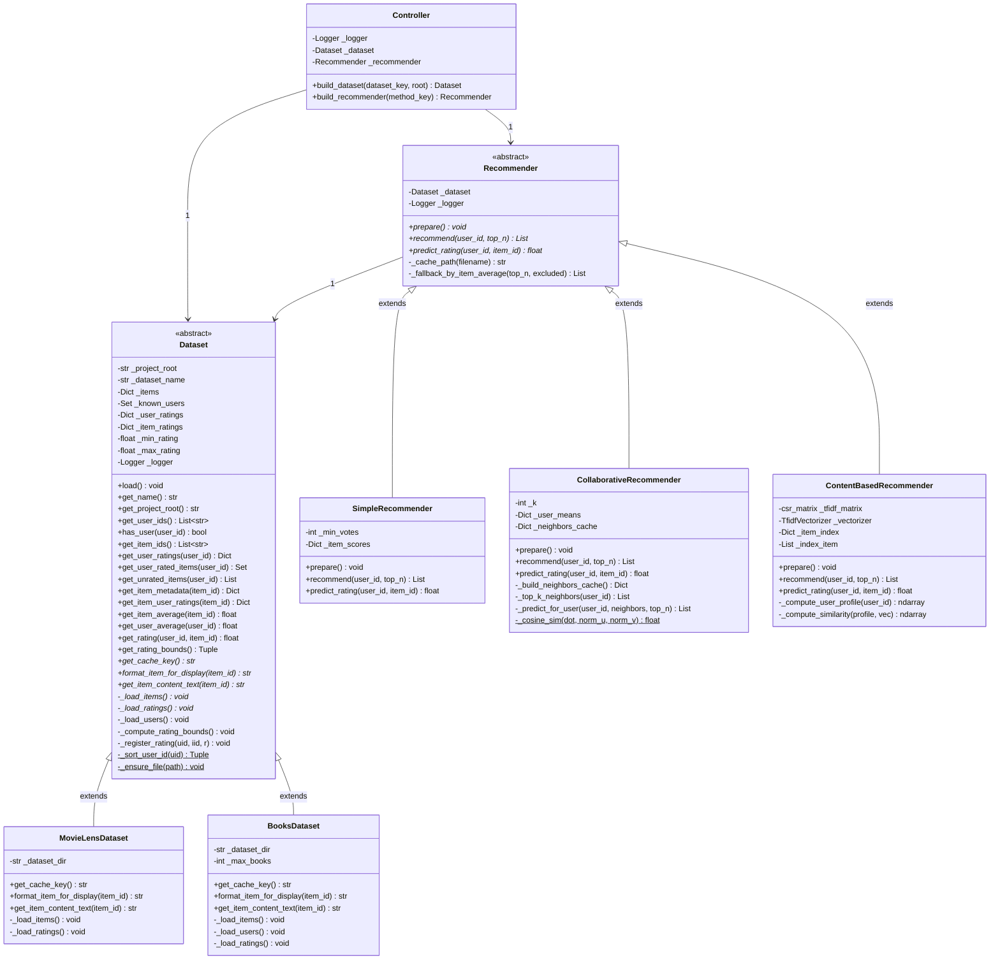
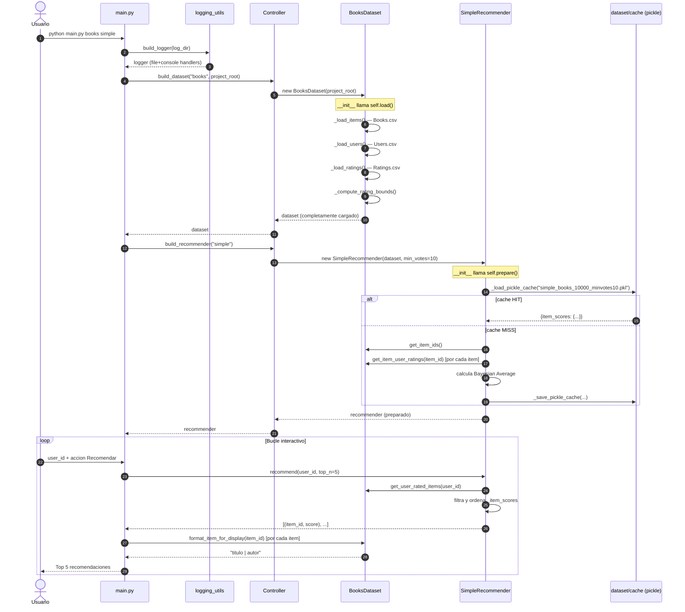
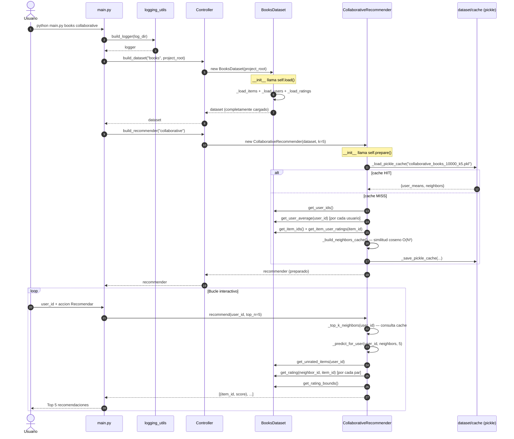
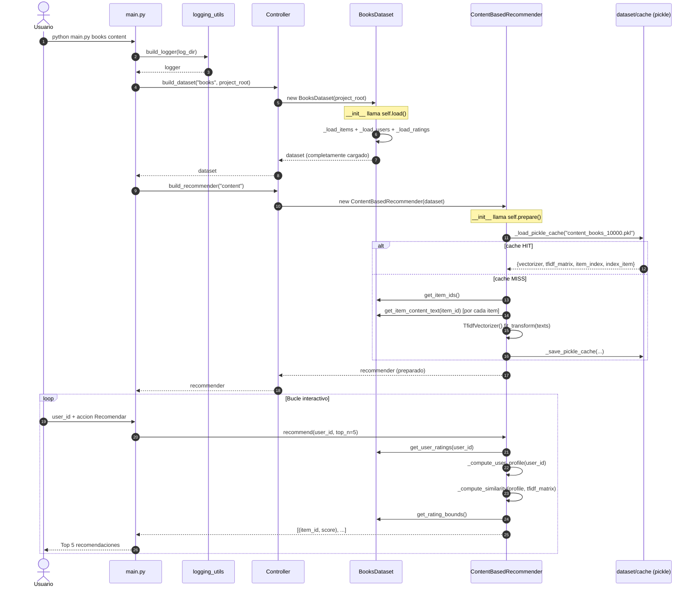
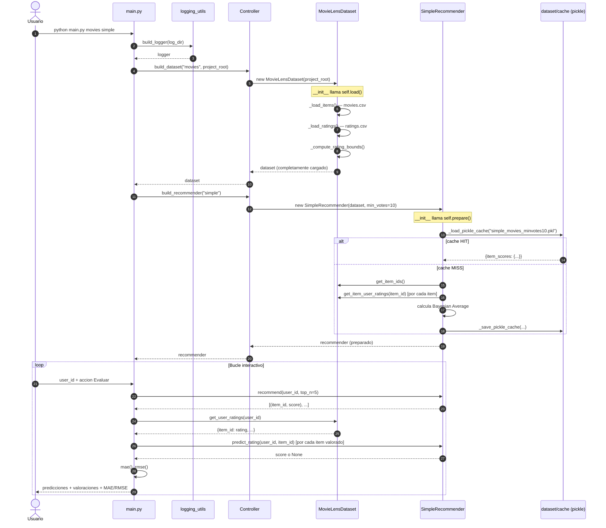
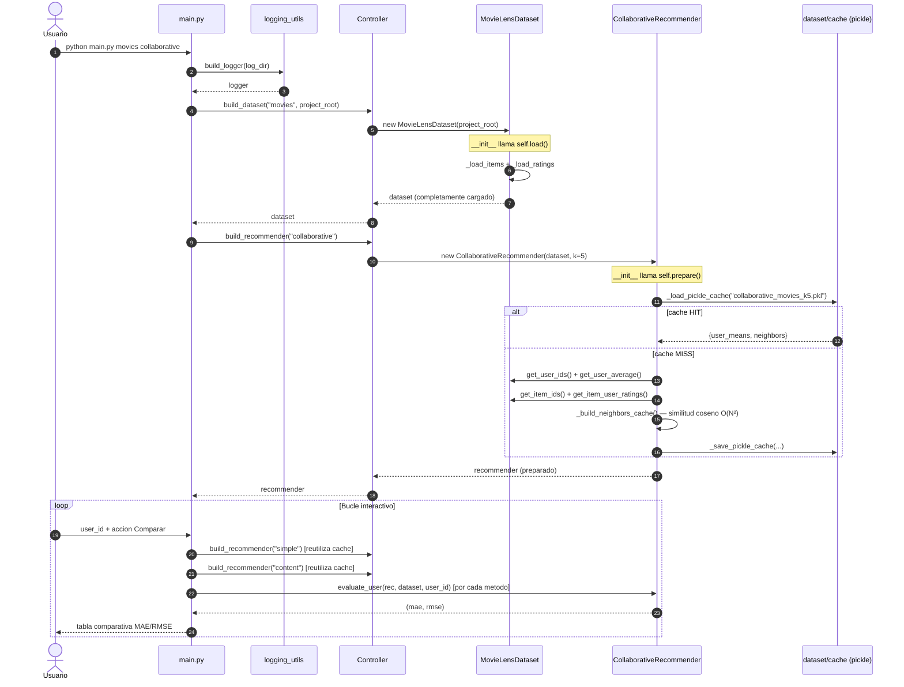
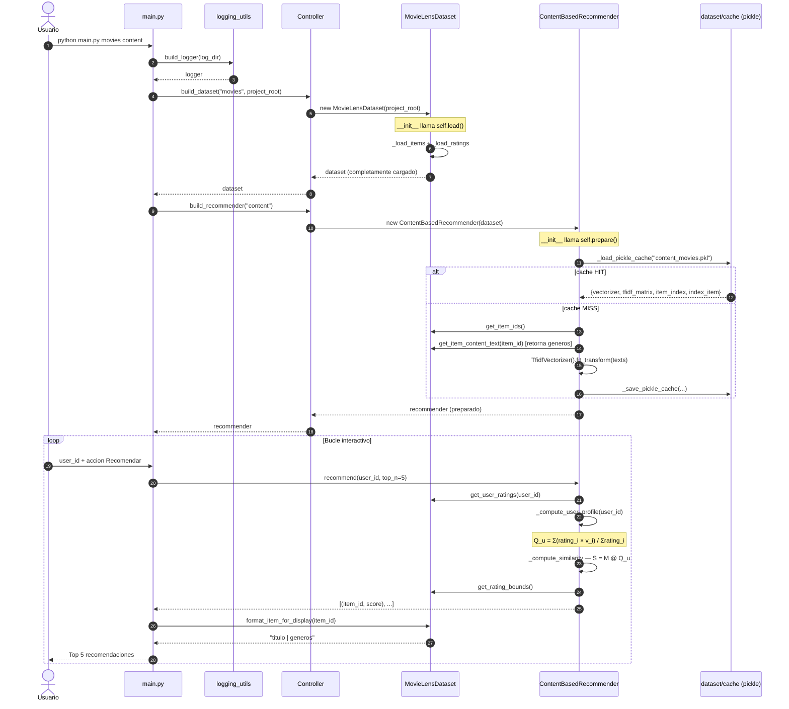

# Sistema de Recomendación (Projecte PA)

## Descripción general

Sistema de recomendación modular con tres algoritmos (Simple, Colaborativo y Basado en Contenido) y soporte para dos datasets (MovieLens 100k y Book-Crossing). Carga datos desde CSV, genera recomendaciones Top-N, evalúa la precisión con MAE/RMSE y compara los tres métodos por consola. Implementado aplicando principios OOP (SRP, LSP, DRY, Information Hiding, Favor Composition, Don't Talk to Strangers) y todos los patrones GRASP (Information Expert, Creator, Controller, Low Coupling, High Cohesion, Polymorphism, Pure Fabrication).

## Estructura del proyecto

```
projectePA/
  datasets.py          — clases de dominio para los datos
  recommenders.py      — motores de recomendación (3 algoritmos)
  evaluation.py        — métricas MAE/RMSE y tabla comparativa
  controller.py        — fábrica y controlador del sistema
  logging_utils.py     — configuración del sistema de logs
  main.py              — interfaz de línea de comandos (CLI)
  dataset/
    Books/
      Books.csv        — metadatos (ISBN, título, autor)
      Ratings.csv      — valoraciones (User-ID, ISBN, Book-Rating)
      Users.csv        — IDs de usuario
    MovieLens100k/
      movies.csv       — metadatos (movieId, título, géneros)
      ratings.csv      — valoraciones (userId, movieId, rating)
      links.csv / tags.csv
    cache/
      *.pkl            — cachés pickle generadas automáticamente
  logs/
    log_YYYYMMDD-HHMMSS.txt
```

---

## Archivos y contenido

### `datasets.py`

Contiene la jerarquía de clases de dominio para la carga y acceso a los datos.

#### Clase abstracta `Dataset` (ABC)

Base de la jerarquía. Define el contrato público que cualquier dataset debe cumplir y encapsula las estructuras internas de datos.

**Atributos privados:**

| Atributo | Tipo | Descripción |
|---|---|---|
| `_project_root` | `str` | Ruta absoluta al raíz del proyecto |
| `_dataset_name` | `str` | Identificador corto (`"movies"` / `"books"`) |
| `_items` | `Dict[str, Dict[str, str]]` | `item_id → {campo: valor}` (título, géneros, autor, …) |
| `_known_users` | `Set[str]` | Todos los user_id conocidos |
| `_user_ratings` | `Dict[str, Dict[str, float]]` | `user_id → {item_id: rating}` |
| `_item_ratings` | `Dict[str, Dict[str, float]]` | `item_id → {user_id: rating}` (índice inverso) |
| `_min_rating` | `Optional[float]` | Mínimo global de valoraciones |
| `_max_rating` | `Optional[float]` | Máximo global de valoraciones |
| `_logger` | `Logger` | Logger de la subclase (`recommender_system.<ClassName>`) |

**Métodos abstractos (contrato obligatorio para subclases):**

- `get_cache_key() → str` — Clave única para nombrar los ficheros de caché pickle. Para `BooksDataset` con `max_books=10000` devuelve `"books_10000"`, evitando colisiones entre configuraciones diferentes.
- `_load_items() → None` — Lee el CSV de metadatos de ítems y rellena `_items`.
- `_load_ratings() → None` — Lee el CSV de valoraciones y llama a `_register_rating`.
- `format_item_for_display(item_id) → str` — Texto legible por humanos (p. ej. `"Toy Story | Animation"` o `"Stephen King | It"`).
- `get_item_content_text(item_id) → str` — Texto plano usado por `ContentBasedRecommender` para construir los vectores TF-IDF (géneros en MovieLens, nombre de autor en Books).

**Métodos concretos heredados (Template Method + Information Expert):**

- `load() → None` — Orquesta la inicialización completa: llama a `_load_items()`, `_load_users()`, `_load_ratings()` y `_compute_rating_bounds()`. Patrón **Template Method**: el esqueleto del algoritmo está en la clase base; los pasos concretos los definen las subclases. Las subclases llaman `self.load()` al final de su `__init__`, eliminando el anti-patrón de inicialización en dos fases.
- `_load_users() → None` — Hook con implementación vacía por defecto. Solo `BooksDataset` lo sobreescribe para leer `Users.csv`.
- `_compute_rating_bounds() → None` — Recorre todas las valoraciones y calcula `_min_rating` / `_max_rating`. Si no hay datos, establece el rango por defecto `[0.0, 5.0]`.
- `_register_rating(user_id, item_id, rating) → None` — Inserta un rating en ambos índices (`_user_ratings` y `_item_ratings`) y añade el usuario a `_known_users`. Un único punto de escritura garantiza consistencia bidireccional (**DRY**).
- `get_user_ratings(user_id) → Dict` — Devuelve una **copia** del dict de ratings del usuario (**Information Hiding**: no expone el dict interno directamente).
- `get_item_user_ratings(item_id) → Dict` — Devuelve una **copia** del dict de valoraciones del ítem.
- `get_item_metadata(item_id) → Dict` — Devuelve una **copia** del dict de metadatos.
- `get_item_average(item_id) → Optional[float]` — Calcula la media aritmética de las valoraciones recibidas por un ítem (**Information Expert**: el dataset posee los datos → él calcula las medias).
- `get_user_average(user_id) → Optional[float]` — Igual para la media de un usuario.
- `get_rating(user_id, item_id) → Optional[float]` — Consulta directa `O(1)` del rating exacto.
- `get_rating_bounds() → Tuple[float, float]` — Devuelve `(min_rating, max_rating)` calculados al cargar.
- `get_unrated_items(user_id) → List[str]` — Lista de ítems que el usuario aún no ha valorado (candidatos a recomendar).
- `get_user_rated_items(user_id) → Set[str]` — Conjunto de ítems ya valorados (para filtrar en recomendación).
- `has_user(user_id) → bool` — Comprobación rápida de existencia de un usuario.
- `get_user_ids() → List[str]` — IDs ordenados usando `_sort_user_id` (numéricamente primero, luego alfabético).
- `get_item_ids() → List[str]` — IDs de ítems ordenados alfabéticamente.

**Métodos estáticos auxiliares:**

- `_sort_user_id(user_id) → Tuple` — Clave de comparación que antepone IDs numéricos (con padding a 20 dígitos) a los alfanuméricos. Permite ordenar `["1", "2", "10"]` correctamente en vez de `["1", "10", "2"]`.
- `_ensure_file(path) → None` — Verifica que el fichero CSV existe en disco antes de abrirlo; lanza `FileNotFoundError` con mensaje descriptivo si no.

**Principios aplicados en `Dataset`:**
- **Information Hiding**: todos los atributos son privados; el acceso externo es siempre mediante métodos getters que devuelven copias.
- **Information Expert** (GRASP): el dataset posee los ratings → calcula promedios, bounds y conjuntos derivados; nadie más lo hace.
- **SRP**: solo gestiona almacenamiento y acceso a datos de dominio.
- **Template Method**: `load()` define el esqueleto; las subclases definen `_load_items`, `_load_ratings`, `_load_users`.
- **LSP**: cualquier subclase es completamente sustituible donde se espera un `Dataset`.
- **Low Coupling**: expone solo getters; los recommenders nunca acceden a `_items` directamente.

---

#### Clase `MovieLensDataset(Dataset)`

Carga el dataset MovieLens 100k desde `dataset/MovieLens100k/`.

**Atributos adicionales:**
- `_dataset_dir: str` — Ruta al directorio `MovieLens100k/`.

**`__init__(project_root)`** — Llama `super().__init__(project_root, "movies")`, establece `_dataset_dir` y llama `self.load()`. No hay inicialización en dos fases: el objeto está completamente listo al salir del constructor.

**`_load_items()`** — Lee `movies.csv` (columnas: `movieId, title, genres`). Filtra filas con menos de 3 columnas o `item_id` vacío. Guarda `{"title": ..., "genres": ...}` en `_items`.

**`_load_ratings()`** — Lee `ratings.csv` (columnas: `userId, movieId, rating`). Filtra ratings ≤ 0 y ítems no presentes en `_items` (integridad referencial). Llama `_register_rating` para cada fila válida.

**`get_cache_key()`** — Devuelve siempre `"movies"`.

**`format_item_for_display(item_id)`** — Devuelve `"<título> | <géneros>"` (p. ej. `"Toy Story (1995) | Animation|Children's|Comedy"`).

**`get_item_content_text(item_id)`** — Devuelve los géneros con `|` reemplazado por espacio (`"Animation Children's Comedy"`). Estos tokens son los features del vectorizador TF-IDF.

---

#### Clase `BooksDataset(Dataset)`

Carga el dataset Book-Crossing desde `dataset/Books/`.

**Atributos adicionales:**
- `_dataset_dir: str` — Ruta al directorio `Books/`.
- `_max_books: int` — Límite máximo de libros a cargar (0 = sin límite). Por defecto `10_000`.

**`__init__(project_root, max_books=10_000)`** — Llama `super().__init__(project_root, "books")`, establece `_dataset_dir` y `_max_books`, y llama `self.load()`.

**`_load_items()`** — Lee `Books.csv` con cabecera dinámica (`header_map = {nombre: índice}`), lo que hace el parser robusto frente a reordenaciones de columnas. Columnas requeridas: `ISBN`, `Book-Title`, `Book-Author`. Lanza `ValueError` si falta alguna. Respeta el límite `_max_books` cortando el bucle al alcanzarlo.

**`_load_users()`** — Lee `Users.csv` y añade todos los `User-ID` válidos a `_known_users`. Es el único caso donde existe un fichero dedicado de usuarios.

**`_load_ratings()`** — Lee `Ratings.csv` con cabecera dinámica. Filtra ratings ≤ 0 e ISBNs no presentes en `_items`. Añade usuarios encontrados en ratings a `_known_users` (unión con los cargados en `_load_users`).

**`get_cache_key()`** — Devuelve `"books_10000"` (o `"books_all"` si `max_books=0`). Garantiza que cachés con distintos límites no colisionen.

**`format_item_for_display(item_id)`** — Devuelve `"<título> | <autor>"` (p. ej. `"Harry Potter | J.K. Rowling"`).

**`get_item_content_text(item_id)`** — Devuelve el nombre del autor como feature textual para TF-IDF.

**Principios adicionales en las subclases:**
- **Creator** (GRASP): cada subclase crea y rellena sus propias estructuras de datos.
- **SRP**: cada clase solo conoce el formato CSV de su dataset concreto.
- **Eliminación del two-phase init**: `self.load()` al final del `__init__` → el objeto es válido y completo desde el instante de creación.

---

### `recommenders.py`

Contiene los tres algoritmos de recomendación, la clase base abstracta y utilidades de caché.

#### Tipo y utilidades a nivel de módulo

**`Recommendation = Tuple[str, float]`** — Alias de tipo para la tupla `(item_id, score)` devuelta por todos los recommenders.

**`_sort_by_score(items: List[Tuple[str, float]]) → None`** — Ordena in-place por score descendente y, como criterio de desempate, por `item_id` ascendente. Extraído como función de módulo para eliminar la duplicación de la misma lambda en 5 lugares distintos (**DRY**). Todos los recommenders que necesitan ordenar candidatos llaman a esta función.

**`_load_pickle_cache(cache_path, logger) → Optional[Any]`** — Intenta cargar un fichero pickle desde disco. Devuelve `None` si no existe o si está corrupto (captura cualquier excepción de deserialización y loguea una advertencia). Patrón **Pure Fabrication**: no pertenece a ninguna entidad de dominio.

**`_save_pickle_cache(cache_path, payload, logger) → None`** — Guarda un objeto en disco de forma **atómica**: escribe primero en un fichero temporal con `tempfile.NamedTemporaryFile` y luego hace `os.replace()` (operación atómica en POSIX). Esto garantiza que jamás queda un fichero de caché corrupto si el proceso se interrumpe a mitad de escritura. Crea el directorio si no existe. En caso de error limpia el temporal.

**Principios:** **DRY** (un único punto de lectura/escritura de caché), **Pure Fabrication** (no son métodos de dominio), **SRP** (cada función tiene exactamente una responsabilidad).

---

#### Clase abstracta `Recommender(ABC)`

Interfaz común que garantiza que los tres algoritmos son intercambiables (**Polymorphism**, **LSP**).

**Atributos:**
- `_dataset: Dataset` — Dataset con el que opera el recommender. Acceso solo a través de la interfaz pública de `Dataset` (**Don't Talk to Strangers**: nunca se accede a `_items` directamente).
- `_logger: Logger` — Logger nombrado con la subclase concreta.

**`__init__(dataset)`** — Inicialización mínima del esqueleto. Las subclases llaman `super().__init__(dataset)` y luego `self.prepare()` al final de su propio `__init__`.

**`_cache_path(filename) → str`** — Calcula la ruta completa `dataset/cache/<filename>` usando `self._dataset.get_project_root()`. Centraliza la lógica de paths de caché (**Information Hiding**, **DRY**).

**`_fallback_by_item_average(top_n, excluded_items) → List[Recommendation]`** — Fallback compartido: cuando un recommender no puede calcular predicciones (sin vecinos, sin historial, sin TF-IDF), devuelve los ítems con mayor media global excluyendo los ya valorados. Definido una sola vez en la base para no duplicarlo en las tres subclases (**DRY**, **High Cohesion**).

**Métodos abstractos:**
- `prepare() → None` — Precomputa o carga desde caché el estado interno del modelo.
- `recommend(user_id, top_n=5) → List[Recommendation]` — Genera las Top-N recomendaciones para un usuario.
- `predict_rating(user_id, item_id) → Optional[float]` — Predice numéricamente la valoración que un usuario daría a un ítem. Usado por `evaluation.py`.

**Principios:**
- **Favor Composition**: todos los recommenders contienen un `Dataset` por composición, no lo heredan.
- **Polymorphism** (GRASP): `main.py` y `evaluation.py` trabajan con `Recommender`, nunca con la subclase concreta.
- **Low Coupling**: la interfaz de `Recommender` no expone detalles del algoritmo; los callers solo invocan `recommend` y `predict_rating`.

---

#### Clase `SimpleRecommender(Recommender)`

Recomendación por popularidad usando el **Bayesian Average** (promedio bayesiano).

**Atributos:**
- `_min_votes: int` — Umbral mínimo de votos para considerar un ítem elegible. También actúa como peso de regularización bayesiana. Por defecto `10`.
- `_item_scores: Dict[str, float]` — `item_id → puntuación bayesiana precomputada`.

**`__init__(dataset, min_votes=10)`** — Inicializa `_min_votes` e `_item_scores` vacío, luego llama `self.prepare()`. El objeto está completamente listo al salir del constructor.

**`prepare()`** — Calcula las puntuaciones bayesianas de todos los ítems:
1. Intenta cargar caché `simple_<cache_key>_minvotes<N>.pkl`.
2. En cache MISS: para cada ítem con `num_votes ≥ min_votes`, calcula:
   ```
   score = (num_votes / (num_votes + min_votes)) * avg_item
           + (min_votes / (num_votes + min_votes)) * avg_global
   ```
3. Guarda el dict en caché.

La fórmula penaliza ítems con pocos votos acercando su score a la media global, dando más peso a los que tienen muchas valoraciones.

**`recommend(user_id, top_n=5)`** — Filtra de `_item_scores` los ítems ya valorados por el usuario. Llama `_sort_by_score` y devuelve los Top-N. Si no hay candidatos, llama al fallback.

**`predict_rating(user_id, item_id)`** — Devuelve `_item_scores.get(item_id)`. La predicción es **independiente del usuario**: el Simple Recommender solo conoce la popularidad global del ítem, no el perfil individual.

**Principios:** **Information Expert** (posee `_item_scores` → predice), **SRP** (solo popularidad bayesiana).

---

#### Clase `CollaborativeRecommender(Recommender)`

**User-Based Collaborative Filtering** con similitud coseno sobre valoraciones centradas en la media.

**Atributos:**
- `_k: int` — Número máximo de vecinos a considerar. Por defecto `5`.
- `_user_means: Dict[str, float]` — `user_id → media de sus valoraciones`.
- `_neighbors_cache: Optional[Dict[str, List[Tuple[str, float]]]]` — `user_id → [(vecino_id, similitud), ...]` ordenados por similitud descendente, ya recortados a K.

**`__init__(dataset, k=5)`** — Inicializa los atributos, llama `self.prepare()`.

**`prepare()`** — Carga o calcula medias de usuarios y la caché de vecinos:
1. Intenta cargar `collaborative_<cache_key>_k<K>.pkl`.
2. En cache MISS: calcula `_user_means` para todos los usuarios. Llama a `_build_neighbors_cache()`. Guarda en caché.

**`_cosine_sim(dot, norm_u, norm_v) → Optional[float]`** (método estático) — Calcula la similitud coseno: `sim = dot / (√norm_u × √norm_v)`. Devuelve `None` si el denominador es 0 o si `sim ≤ 0` (similitudes negativas o nulas no aportan). Extraído como método estático para eliminar el cálculo duplicado en `_build_neighbors_cache` y `_top_k_neighbors` (**DRY**).

**`_build_neighbors_cache() → Dict`** — Cálculo O(N²) eficiente de similitudes cruzadas entre todos los usuarios. Para cada ítem con ≥ 2 valoraciones, acumula en `stats[u][v]` los productos parciales `(dot, norm_u, norm_v)` necesarios para la similitud coseno. Evita recalcular por pares llamando a `_cosine_sim` solo una vez por par. Guarda solo los K más similares por usuario usando `_sort_by_score`.

**`_top_k_neighbors(user_id) → List`** — Si existe `_neighbors_cache`, lo consulta directamente (O(1)). Si no (fallback on-demand), calcula similitudes solo con los usuarios que comparten ítems con el usuario objetivo.

**`_predict_for_user(user_id, neighbors, top_n) → List`** — Para cada ítem no valorado por el usuario objetivo, aplica la fórmula de CF centrada en la media:
```
score = avg_u + Σ(sim_v × (rating_vi - avg_v)) / Σ|sim_v|
```
El resultado se clampa a `[min_rating, max_rating]`.

**`recommend(user_id, top_n=5)`** — Comprueba que el usuario tiene media calculada y vecinos. Llama a `_predict_for_user`. Usa fallback en cualquier caso sin datos suficientes.

**`predict_rating(user_id, item_id)`** — Aplica la misma fórmula de CF para un ítem concreto, devuelve `None` si no hay datos suficientes.

**Principios:** **DRY** (`_cosine_sim` extraído, `_sort_by_score` compartido), **Information Expert** (posee `_user_means` y `_neighbors_cache` → predice), **High Cohesion** (toda la lógica CF en una clase), **Low Coupling** (accede al dataset solo por su interfaz pública).

---

#### Clase `ContentBasedRecommender(Recommender)`

Recomendación **Basada en Contenido** mediante vectorización TF-IDF del texto de los ítems y perfil de usuario como combinación lineal ponderada.

**Atributos:**
- `_tfidf_matrix: csr_matrix | None` — Matriz TF-IDF de forma `(n_items, n_features)`.
- `_vectorizer: TfidfVectorizer | None` — Vectorizador de sklearn ajustado sobre todos los textos.
- `_item_index: Dict[str, int]` — `item_id → fila` en la matriz TF-IDF.
- `_index_item: List[str]` — Lista inversa: `fila → item_id`.

**`__init__(dataset)`** — Inicializa los atributos a `None` / vacío, llama `self.prepare()`.

**`prepare()`** — Construye la matriz TF-IDF:
1. Intenta cargar `content_<cache_key>.pkl` (guarda `vectorizer`, `tfidf_matrix`, `item_index`, `index_item`).
2. En cache MISS: recoge textos de `get_item_content_text()` para todos los ítems que tienen texto no vacío. Ajusta `TfidfVectorizer().fit_transform(texts)`. Construye `_item_index` e `_index_item`. Guarda en caché. Si no hay ningún texto disponible, no guarda caché.

**`_compute_user_profile(user_id) → Optional[np.ndarray]`** — Construye el vector de perfil del usuario como media ponderada de los vectores TF-IDF de los ítems que ha valorado:
```
Q_u = Σ(rating_i × v_i) / Σ(rating_i)
```
Solo considera ítems indexados en `_item_index`. Devuelve `None` si no hay interacciones indexables.

**`_compute_similarity(user_profile, item_vector_or_matrix) → np.ndarray`** — Producto escalar puro `M @ Q_u`. Sin normalización coseno adicional, siguiendo la especificación del proyecto (`S_u = M · Q_u^T`). Funciona tanto con el vector de un único ítem como con la matriz completa.

**`recommend(user_id, top_n=5)`** — Construye el perfil `Q_u`. Calcula similitudes con todos los ítems vía `_compute_similarity`. Escala el resultado a `[0, max_rating]` multiplicando por `max_rating`. Filtra ítems ya valorados, ordena con `_sort_by_score` y devuelve Top-N.

**`predict_rating(user_id, item_id)`** — Extrae el vector TF-IDF del ítem concreto. Calcula el producto escalar con el perfil del usuario. Multiplica por `max_rating`.

**Principios:** **Favor Composition** (`TfidfVectorizer` de sklearn se usa por composición, no herencia), **High Cohesion** (toda la lógica TF-IDF en una clase), **SRP** (solo recomendación basada en contenido), **Information Expert** (posee `_tfidf_matrix` → calcula similitudes).

---

### `evaluation.py`

Módulo de utilidades para calcular y mostrar métricas de evaluación. No contiene estado de dominio: es una **Pure Fabrication** (GRASP).

#### `mae(predictions, actuals) → float`

Calcula el Error Absoluto Medio:
```
MAE = Σ|pred_i - actual_i| / N
```
Devuelve `float('nan')` si las listas están vacías o tienen distinta longitud.

#### `rmse(predictions, actuals) → float`

Calcula la Raíz del Error Cuadrático Medio:
```
RMSE = √(Σ(pred_i - actual_i)² / N)
```
Devuelve `float('nan')` si las listas están vacías o tienen distinta longitud.

#### `evaluate_user(recommender, dataset, user_id) → Tuple[Optional[float], Optional[float]]`

Para cada ítem que el usuario ha valorado realmente, solicita `recommender.predict_rating(user_id, item_id)`. Acumula pares `(predicción, valoración_real)` solo cuando `predict_rating` devuelve un valor no `None`. Calcula y devuelve `(mae, rmse)`. Devuelve `(None, None)` si no hay ninguna predicción posible.

**Don't Talk to Strangers**: accede al dataset únicamente a través de `dataset.get_user_ratings()` y al recommender a través de `recommender.predict_rating()`. Nunca accede a los internos de ninguno.

#### `print_evaluation(user_id, mae_dict, rmse_dict) → None`

Imprime una tabla comparativa alineada por consola:
```
Resultats de comparacio per l'usuari 1:
  Metode            MAE     RMSE
  --------------- -------- --------
  Simple            0.9431   1.0674
  Colaboratiu       0.8102   0.9554
  Contingut         1.1023   1.3241
```
Usa f-strings con especificadores de alineación (`:<15`, `:>8.4f`).

**Principios:** **Pure Fabrication** (GRASP, funciones de utilidad sin entidad de dominio asociada), **SRP** (cada función tiene exactamente una responsabilidad matemática o de presentación), **Low Coupling** (ninguna dependencia de estado global).

---

### `controller.py`

Controlador del sistema que centraliza la creación de datasets y recommenders. Implementa el patrón **Controller** (GRASP) y actúa como **Creator** (GRASP).

#### Registros de fábricas a nivel de módulo

```python
_DATASET_BUILDERS: Dict[str, Callable[[str], Dataset]] = {
    "movies": lambda root: MovieLensDataset(root),
    "books":  lambda root: BooksDataset(root, max_books=10_000),
}

_RECOMMENDER_BUILDERS: Dict[str, Callable[[Dataset], Recommender]] = {
    "simple":        lambda ds: SimpleRecommender(ds, min_votes=10),
    "collaborative": lambda ds: CollaborativeRecommender(ds, k=5),
    "content":       lambda ds: ContentBasedRecommender(ds),
}
```

Reemplazan las cadenas `if/elif` por acceso `O(1)` a diccionarios. Para añadir un nuevo dataset o algoritmo basta con añadir una entrada al dict: no hay que modificar lógica existente (**Polymorphism** GRASP, **Open/Closed Principle**). Las lambdas desacoplan el `Controller` de los parámetros concretos de construcción (**Low Coupling**).

#### Clase `Controller`

**Atributos:**
- `_logger: Logger` — Logger del controlador (acepta instancia externa o usa el del módulo).
- `_dataset: Optional[Dataset]` — Último dataset construido; `None` hasta la primera llamada a `build_dataset`.
- `_recommender: Optional[Recommender]` — Último recommender construido.

**`__init__(logger_instance=None)`** — Acepta un logger externo (útil para tests) o usa el del módulo por defecto.

**`build_dataset(dataset_key, project_root) → Dataset`** — Busca en `_DATASET_BUILDERS`. Si no existe la clave, loguea el error y lanza `ValueError`. Si existe, invoca la lambda (que crea y carga completamente el dataset vía su `__init__`). Almacena la instancia en `_dataset` para uso posterior por `build_recommender`.

**`build_recommender(method_key) → Recommender`** — Verifica que `_dataset` no es `None` (lanza `ValueError` si no se ha llamado antes a `build_dataset`). Busca en `_RECOMMENDER_BUILDERS`. Invoca la lambda (que crea y prepara completamente el recommender vía su `__init__`). Almacena en `_recommender`.

**Principios:**
- **Controller** (GRASP): punto de entrada único para crear componentes del sistema; desacopla `main.py` de las clases concretas.
- **Creator** (GRASP): el `Controller` contiene el dataset y el recommender → es responsable de crearlos.
- **Polymorphism** (GRASP): los dicts de lambdas sustituyen los `if/elif` sobre strings, eliminando la ramificación condicional.
- **Low Coupling**: `main.py` solo importa `Controller`; no importa directamente `MovieLensDataset`, `SimpleRecommender`, etc.
- **DRY**: la lógica de selección está en un solo lugar (los dicts), no dispersa en varios `if/elif`.

---

### `logging_utils.py`

Módulo de utilidad para configurar el sistema de trazas. **Pure Fabrication** (GRASP): no modela ninguna entidad del dominio.

#### `build_logger(log_dir) → logging.Logger`

Configura y devuelve el logger raíz `"recommender_system"` con dos handlers:

| Handler | Nivel | Destino |
|---|---|---|
| `FileHandler` | `DEBUG` | `logs/log_YYYYMMDD-HHMMSS.txt` (fichero con timestamp) |
| `StreamHandler` | `INFO` | Consola (`stdout`) |

Formato común: `%(asctime)s | %(levelname)-8s | %(name)s | %(message)s`.

Limpia los handlers existentes antes de añadir los nuevos (evita duplicación de logs si se invoca varias veces en la misma sesión). Crea el directorio `log_dir` si no existe.

Los loggers de los datasets y recommenders heredan del raíz `"recommender_system"` mediante la jerarquía de Python (`recommender_system.MovieLensDataset`, `recommender_system.SimpleRecommender`, etc.), por lo que todos sus mensajes fluyen al mismo fichero y consola.

**Principios:** **Pure Fabrication** (GRASP, infraestructura pura), **SRP** (solo configura logging), **Low Coupling** (el resto del sistema solo importa `build_logger`, no conoce el nombre del fichero ni el formato).

---

### `main.py`

Interfaz de línea de comandos. Actúa como **Controller** GRASP a nivel de presentación: gestiona toda la entrada/salida del usuario y delega la lógica al `Controller` de dominio.

**Constantes:**
- `VALID_DATASETS = {"movies", "books"}` — Conjunto de claves válidas para validación CLI.
- `VALID_METHODS = {"simple", "collaborative", "content"}` — Ídem para métodos.
- `ALL_METHODS = ["simple", "collaborative", "content"]` — Orden de iteración en la comparación.
- `METHOD_LABELS = {"simple": "Simple", ...}` — Etiquetas legibles para presentación.

#### Funciones

**`print_usage()`** — Imprime la ayuda de uso (`python main.py <dataset> <metodo>`).

**`read_action() → str`** — Muestra el menú interactivo (4 opciones) y normaliza la entrada del usuario a `"recommend"`, `"evaluate"`, `"compare"`, `"exit"` o `"invalid"`. Acepta tanto números (`"1"`) como nombres (`"recomanar"`, `"recommend"`).

**`show_recommendations(dataset, recommendations, N=5)`** — Formatea e imprime las Top-N recomendaciones. Para cada `(item_id, score)` llama a `dataset.format_item_for_display(item_id)` (**Don't Talk to Strangers**: nunca accede a `dataset._items` directamente).

**`show_evaluation(dataset, recommender, user_id, top_n=5)`** — Muestra tres secciones:
1. Top-`top_n` predicciones del recommender para el usuario.
2. Valoraciones reales del usuario (`dataset.get_user_ratings(user_id)`).
3. Métricas MAE y RMSE calculadas por `evaluate_user`.

**`show_comparison(dataset, user_id, logger, controller)`** — Itera sobre los tres métodos, construye cada recommender mediante `controller.build_recommender(method_key)` (reutiliza caché si existe) y calcula sus métricas. Imprime la tabla comparativa con columnas alineadas. Registra errores por método sin abortar la comparación completa.

**`load_dataset(project_root, dataset_key, logger, controller) → Dataset`** — Delegación simple a `controller.build_dataset()`. Loguea la operación.

**`load_recommender(method_key, logger, controller) → Recommender`** — Delegación simple a `controller.build_recommender()`. Loguea la operación.

**`run_interactive_loop(dataset, recommender, logger, controller) → int`** — Bucle principal: solicita un `user_id`, valida su existencia con `dataset.has_user()`, y entra en el submenú de acciones hasta recibir `"exit"`. Devuelve el código de salida `0`.

**`main() → int`** — Punto de entrada. Valida `sys.argv` (exactamente 3 argumentos, claves válidas). Construye el logger, el controller, carga el dataset y el recommender inicial, y llama al bucle interactivo. Captura cualquier excepción en la inicialización y devuelve `1`.

**Principios:**
- **Controller** (GRASP): gestiona toda la UI; delega creación al `Controller` y cálculos a `evaluation.py`.
- **SRP**: cada función gestiona exactamente un aspecto de la presentación.
- **Don't Talk to Strangers**: `main.py` habla con `Dataset` y `Recommender` solo a través de sus interfaces públicas; nunca accede a `_items`, `_user_ratings` u otros atributos privados.
- **High Cohesion**: todo el código de I/O en un único módulo.
- **Low Coupling**: las únicas importaciones de dominio son `Dataset`, `Recommender`, `Controller` y `evaluate_user`.

---

## Diagrama de clases



---

## Diagramas de secuencia

> En todos los diagramas, la carga del dataset (`load()`) y la preparación del recommender (`prepare()`) ocurren **dentro del constructor** de cada clase, no como llamadas externas del `Controller`.

### Books + Simple



### Books + Collaborative



### Books + Content



### Movies + Simple



### Movies + Collaborative



### Movies + Content



---

## Resumen de principios y patrones aplicados

| Principio / Patrón | Dónde se aplica |
|---|---|
| **Information Hiding** | `Dataset`: atributos privados, getters devuelven copias. `Recommender`: `_cache_path`, `_neighbors_cache` ocultos. |
| **Don't Talk to Strangers** | `evaluation.py` accede solo a `Dataset.get_user_ratings` y `Recommender.predict_rating`. `main.py` nunca accede a internos. |
| **DRY** | `_sort_by_score` (5 lambdas → 1 función). `_cosine_sim` (duplicado → estático). `_register_rating` (índice bidireccional en un punto). `_fallback_by_item_average` (compartido por 3 subclases). |
| **SRP** | Cada clase/función tiene una sola razón de cambio. `evaluation.py` solo métricas. `logging_utils.py` solo logging. |
| **LSP** | `MovieLensDataset` y `BooksDataset` sustituyen a `Dataset`. Los 3 recommenders sustituyen a `Recommender`. |
| **Favor Composition** | `Recommender` contiene un `Dataset` por composición. `ContentBasedRecommender` usa `TfidfVectorizer` por composición. |
| **Information Expert** (GRASP) | `Dataset` calcula promedios y bounds. `SimpleRecommender` posee `_item_scores`. `CollaborativeRecommender` posee `_user_means` y `_neighbors_cache`. |
| **Creator** (GRASP) | `Controller` crea `Dataset` y `Recommender`. Cada dataset crea sus propios dicts de ítems y ratings. |
| **Low Coupling** (GRASP) | `_DATASET_BUILDERS` / `_RECOMMENDER_BUILDERS` en `controller.py`. `main.py` solo importa `Controller`. |
| **High Cohesion** (GRASP) | Todo CF en `CollaborativeRecommender`. Todo TF-IDF en `ContentBasedRecommender`. Todo I/O en `main.py`. |
| **Polymorphism** (GRASP) | Dicts de lambdas en `controller.py` reemplazan `if/elif`. `main.py` trabaja siempre con `Recommender` abstracto. |
| **Controller** (GRASP) | `Controller` coordina la creación del sistema. `main.py` coordina la UI. |
| **Pure Fabrication** (GRASP) | `evaluation.py` (métricas). `logging_utils.py` (infraestructura de logs). `_load_pickle_cache` / `_save_pickle_cache` (caché). |
| **Template Method** | `Dataset.load()` orquesta `_load_items → _load_users → _load_ratings → _compute_rating_bounds`. |
| **Eliminación two-phase init** | `self.load()` en `__init__` de datasets. `self.prepare()` en `__init__` de recommenders. Objetos válidos y completos desde el instante de creación. |

---

## Requisitos

```
pip install numpy scikit-learn
```

Python 3.9+.

## Uso

```bash
python main.py <dataset> <metodo>
```

- `<dataset>`: `movies` | `books`
- `<metodo>`: `simple` | `collaborative` | `content`

**Ejemplo:**
```bash
python main.py movies collaborative
```

### Flujo interactivo

1. Introducir un `user_id` válido (el programa valida su existencia).
2. Elegir acción:
   - **1 — Recomanar**: muestra Top-5 ítems recomendados con score.
   - **2 — Avaluar**: muestra las predicciones, las valoraciones reales del usuario y las métricas MAE/RMSE.
   - **3 — Comparar**: evalúa los tres métodos e imprime una tabla comparativa de MAE/RMSE.
   - **4 — Sortir**: termina el programa.

### Caché

Los ficheros `.pkl` se generan en `dataset/cache/` la primera vez que se usa cada combinación de dataset+método. Las ejecuciones siguientes los cargan directamente, acelerando el arranque considerablemente (sobre todo para el modo Colaborativo con MovieLens).

### Logs

Cada ejecución genera un fichero `logs/log_YYYYMMDD-HHMMSS.txt` con trazas DEBUG completas. La consola muestra solo nivel INFO.
